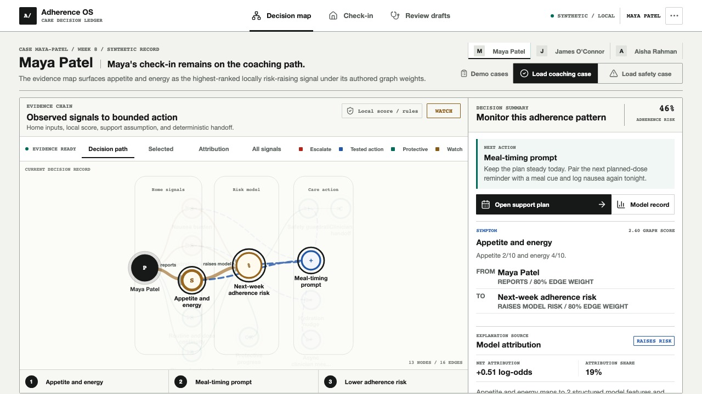

# Adherence OS

AI-supported at-home GLP-1 metabolic care prototype for the Reimagine Health with eMed hackathon.



*The care decision ledger connects synthetic home signals, local ML attribution, one bounded support assumption, and an independent safety boundary without hiding clinical ownership.*

## What It Shows

- GLP-1 obesity and metabolic-care focus.
- Synthetic 8-week JSON data for 3 patients.
- Patient check-in flow with explicitly labelled coaching and safety demo cases plus an eight-item current-symptom safety checklist.
- Review workspace with async summaries, explicit draft ownership, and independent in-memory state for each synthetic patient.
- Routed synthetic patient directory with summary metrics, clickable records, and loading/error/empty states.
- Deterministic decision-pipeline trace for intake, trends, adherence risk, guardrails, and clinician handoff.
- Clickable decision evidence graph with decision-path, selected-neighbourhood, attribution, and all-signal focus modes.
- Per-node provenance that distinguishes model attribution, bounded simulation, deterministic rules, and patient context.
- A marginal feature-bounds gate that withholds patient score, attribution, spread, sensitivity, and tested-action ranking when any feature exceeds its configured training-only range.
- Personalised adherence-risk summary with context signals, model contributors, protective factors, and an explicitly heuristic failure-point narrative.
- 7-day Rescue Plan with patient micro-actions and clinician triggers.
- Unsafe medication-request demo that blocks dose-change advice.
- Model record with prospective synthetic-cohort training, a 16-member patient-bootstrap ensemble, exact supported local decomposition, complete patient-evidence abstention, reliability bins, and transparent what-if simulation.
- Judging scorecard mapped to user impact, innovation, feasibility, and demo quality.
- Safety rules: no diagnosis, no medication changes, structured red flags override coaching, and free-text matching remains a secondary backstop.
- Optional OpenAI structured-output API route with deterministic safety fallback.
- Original care-ledger UI informed by the NHS service manual, Carbon data patterns, OpenMRS O3 clinical workflows, and eMed product context; no external screen or template code is copied.

## Run Locally

Prerequisites: Node.js 22+ and pnpm 11. Python 3 with NumPy is only required to regenerate the synthetic model artifact.

```bash
npm install --global corepack@latest
corepack enable pnpm
pnpm install
pnpm dev
```

Open `http://localhost:3000`.

Development output is isolated in `.next-dev`; production build and start use `.next`. This prevents `pnpm build` from corrupting an active development session. Stop an existing production server before rebuilding because production build and start share `.next` by design.

Confirm the running demo and model artifact are ready:

```bash
pnpm smoke
```

The health endpoint is available at `http://localhost:3000/api/health`.
After `pnpm build`, `pnpm check:bundle` enforces a 155 kB gzip budget for home first-load JavaScript.

Run the production-browser quality gate:

```bash
pnpm exec playwright install chromium
pnpm build
pnpm test:browser
```

The suite starts the built app on port 3100 when `APP_URL` is unset. It covers the judged coaching/safety/handoff path, keyboard announcements and focus, presenter-control semantics, visible mobile actions, 390/320px ordering and overflow, console errors, and serious or critical axe findings across the four core views. Automated accessibility checks catch only a subset of accessibility problems; manual assistive-technology and user testing are still required.

## Demo Assets

- [2:59 narrated and captioned video walkthrough](outputs/adherence-os-demo.mp4)
- [English subtitle track](outputs/adherence-os-demo.srt)
- [10-slide presentation deck](outputs/adherence-os-demo.pptx)
- [Screenshot-led product walkthrough](docs/product-walkthrough.md)

Refresh the walkthrough images from a running production build:

```bash
APP_URL=http://127.0.0.1:3000 pnpm capture:walkthrough
```

## Two-Minute Judge Path

1. Open `/`. **Decision map** starts on synthetic patient Maya Patel with **Load coaching case** selected.
2. Read the supported **46%** interruption risk and **Meal-timing prompt**, a bounded comparison that lowers the scenario score by **19 percentage points**.
3. Click **Attribution**, then **Nausea burden** and **Meal-timing prompt**, to connect the largest risk-raising model group to the top tested action.
4. Click **Load safety case**. Point out **Abstained**, **Suppressed**, and the red path to the safety guardrail and local handoff draft.
5. Click **Review handoff draft** to land in **Review drafts** on the selected local record, unsent state, and deterministic audit trail.
6. Open **Model record** only if technical judges ask for temporal leakage controls, bootstrap model spread, exact score decomposition, marginal-bound abstention, or artifact provenance.

The core story is four moments: coachable risk, one explained driver/action pair, deterministic safety override, and a human-owned local review draft. Do not describe graph paths or tested actions as causal, or synthetic metrics as clinical validation.

## Optional OpenAI Mode

Copy `.env.example` to `.env.local` and add an API key:

```bash
OPENAI_API_KEY=...
OPENAI_MODEL=gpt-5.5
```

Without a key, the app still runs using the local safety engine.
When a key is configured, provider requests use an eight-second deadline with retries disabled. The current safety-first merge validates the response but recomputes and returns the full deterministic plan, so provider wording is not shown.
The care-plan endpoint is intentionally unauthenticated in this MVP, so do not deploy it publicly with an unrestricted paid key. Keyless mode is the recommended judged-demo configuration.

## ML Model Record

Regenerate the synthetic cohort and edge model:

```bash
python3 -m pip install -r requirements-model.txt
pnpm check:model
pnpm train:model
```

`pnpm check:model` retrains in memory and fails if feature order, consensus or bootstrap values, metrics, support bounds, or parity fixtures drift from the checked-in artifact. `pnpm train:model` is the explicit write command. The exported model lives at `data/adherence-model.json` and is used by the Model record view for local browser inference. Directional coefficients use authored projected-gradient constraints. The metrics are synthetic pipeline evidence, not clinical validation.

## Troubleshooting

### `pnpm: command not found`

This repository pins pnpm 11 and requires Node.js 22+. Corepack is no longer bundled starting with Node.js 25, so install or update it explicitly:

```bash
node --version
npm install --global corepack@latest
corepack enable pnpm
pnpm --version
```

The expected pnpm version is in `package.json`. See the official [pnpm installation guide](https://pnpm.io/installation) and [Node.js Corepack notes](https://nodejs.org/download/release/v25.8.0/docs/api/corepack.html).

### Port 3000 is already in use

Identify the existing process, or run this app on another port:

```bash
lsof -nP -iTCP:3000 -sTCP:LISTEN
pnpm exec next dev -p 3001
APP_URL=http://localhost:3001 pnpm smoke
```

### Smoke cannot connect

`pnpm smoke` checks a running app; it does not start one. Run `pnpm dev` during development or `pnpm build && pnpm start` for the judged production path, then retry smoke in a second terminal.

### Model check cannot import NumPy

```bash
python3 -m pip install -r requirements-model.txt
pnpm check:model
```

### The UI says OpenAI is not configured

That is the recommended keyless demo mode, not an error. The complete deterministic plan, evidence map, tested actions, and safety handoff remain available. After changing `.env.local`, restart the app so Next.js reloads the environment.

## Product and Technical Notes

- [Screenshot-led product walkthrough](docs/product-walkthrough.md)
- [Project audit](docs/project_audit.md)
- [Improvement backlog](docs/improvement_backlog.md)
- [Architecture and study guide](docs/architecture.md)
- [Deployment runbook](docs/deployment.md)
- [Design references](docs/design-references.md)
- [Three-minute demo script](docs/demo_script.md)
- [ML model record](docs/ml-model-lab.md)
- [Product and ML glossary](docs/glossary.md)
- [Safety rules](docs/safety-rules.md)
