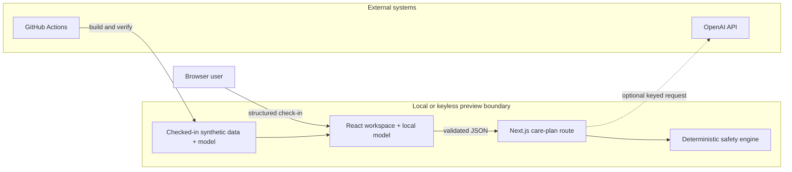

# Threat Model

## Method And Scope

This threat model covers the implemented synthetic-data Next.js prototype and its optional OpenAI boundary. It does not assert compliance or cover a future EHR-integrated platform. STRIDE-style categories are used where useful.

## Assets

- Integrity of deterministic safety rules and urgent destinations.
- Integrity of the model artifact, feature contract, and evaluation evidence.
- Confidentiality of any locally entered check-in text.
- Optional provider credential and usage budget.
- Availability of the live judged demo.
- Trustworthiness of review-draft delivery labels and audit trace.
- Repository and CI integrity.

## Actors

- Patient using the synthetic check-in.
- Care navigator or clinician reviewing a local draft.
- Presenter or reviewer running the demo.
- Opportunistic unauthenticated caller if a preview is exposed.
- Malicious dependency, contributor, or compromised CI identity.
- External AI provider when a key is configured.

## Trust Boundaries

## Threats And Mitigations

| Threat | Category | Implemented mitigation | Residual risk |
|---|---|---|---|
| Caller submits malformed or inconsistent check-in data | Tampering | Zod validation, patient identifier match, known synthetic patient lookup | No authenticated ownership check |
| Prompt injection in free text tries to alter safety or medication advice | Tampering / elevation | Provider output is schema-validated; displayed plan is recomputed deterministically; diagnosis and medication language is guarded | Provider still receives the text in keyed local mode |
| Provider timeout or outage blocks the workflow | Availability | Eight-second timeout, zero retries, complete deterministic fallback | One request can remain pending until timeout |
| Public caller drains a paid provider key | Denial of service / cost abuse | Public keyed deployment is prohibited and keyless mode is complete | No route authentication or rate limiting if guidance is ignored |
| Missing or malformed feature silently produces a score | Integrity | Versioned source contract, runtime artifact validation, typed support violations, abstention | Marginal checks do not detect joint or semantic drift |
| Model output suppresses urgent care | Safety / elevation | Safety rules are independent; active flags override every model and tested action | Phrase backstop is not clinical language understanding |
| UI implies a clinician was contacted | Repudiation / integrity | Visible `In-memory only`, `Not sent`, and draft labels; deterministic tests | No durable signed audit log |
| Free text is exposed in logs | Information disclosure | Logs contain only short provider error messages; policy forbids request logging | Framework or hosting logs require separate production review |
| App is embedded in a deceptive frame | Spoofing | `X-Frame-Options: DENY` | CSP `frame-ancestors` is not yet configured |
| Browser requests camera, microphone, or location unexpectedly | Information disclosure | Permissions Policy disables all three | Future features must explicitly revise the policy |
| Malicious model or fixture change falsifies evidence | Supply chain / tampering | Deterministic reproduction, artifact parser, cross-language parity, tests, PR CI | Maintainer compromise or colluding code and fixture changes remain possible |
| Dependency compromise changes build output | Supply chain | Frozen lockfile in CI, minimal dependencies, clean build | No provenance attestation or automated vulnerability gate |
| Browser refresh destroys review state | Availability / repudiation | UI explicitly labels in-memory scope; Reset and fallback assets are documented | No persistence or recovery after refresh |

## Abuse Cases

### Unsafe Medication Request

An input asks whether to double, stop, restart, or change medication. Expected behavior: the deterministic guardrail removes the instruction, provides no diagnosis, and prepares clinician-owned language where appropriate.

### Adversarial Symptom Negation

An input combines an active urgent symptom with a denial in another field. Expected behavior: one field cannot negate a red flag in another; explicit resolved historical symptoms remain separate.

### Unsupported Model, No Red Flag

One raw feature is missing or outside support. Expected behavior: no score, attribution, spread, sensitivity, ranked action, or lower-risk path appears; deterministic non-urgent care rules remain visible.

### Unsupported Model, Red Flag

The model abstains while vomiting, inability to keep fluids down, worsening abdominal pain, or another structured flag is active. Expected behavior: urgent destination and review draft remain active, and every coaching action is suppressed.

## Security Test Evidence

- API malformed-input and patient-identity tests.
- Provider timeout, exception, invalid-output, and unsafe-language tests.
- Adversarial urgent phrase and structured-flag tests.
- Four model-support by safety-state graph contract.
- Feature-contract version, missing-value, raw parity, and artifact integrity tests.
- Chromium checks for truthful unsent state, focus, accessibility, and console errors.
- Configuration test for baseline security headers.

## Residual Risk Acceptance

The current residual risks are acceptable only because the app uses synthetic data, defaults to keyless mode, has no persistent delivery, and is presented as a prototype. Enabling real patient data, persistence, external messaging, or a public provider key invalidates this acceptance and requires a new threat model and formal review.
