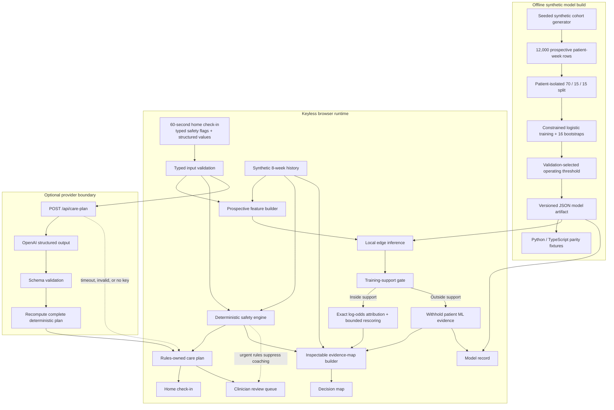

# Architecture And Study Guide

Adherence OS is a browser-first prototype for at-home GLP-1 adherence support. Its central design choice is separation: prediction estimates adherence interruption, the evidence map distinguishes context from model contribution and tested action, deterministic rules own safety, and a clinician remains responsible for review.

## Whole-System Diagram



The dotted provider fallback is deliberate. The judged demo is complete without a key; optional generated output cannot weaken, rewrite, or own the displayed care plan.

## One Check-In, Step By Step

```mermaid
sequenceDiagram
    actor Patient
    participant UI as React workspace
    participant Rules as Deterministic care engine
    participant ML as Browser edge model
    participant Graph as Evidence-map builder
    participant API as Optional care-plan API
    participant Clinician as Review queue

    Patient->>UI: Submit or edit structured values and current-symptom flags
    UI->>Rules: Evaluate explicit flags, phrase backstop, adherence, and thresholds
    UI->>ML: Build week-t features and score week-t+1 interruption
    ML-->>UI: Support status; patient ML evidence only inside support
    Rules-->>UI: Coaching mode or destination-specific handoff draft
    UI->>Graph: Combine context, model evidence, and safety state
    Graph-->>UI: Nodes, typed edges, provenance, and rescue path
    opt Provider key configured
        UI->>API: Send validated structured request
        API-->>UI: Validated provider attempt metadata
        UI->>Rules: Keep the recomputed deterministic plan
    end
    alt Red flag active
        UI->>Clinician: Show pending draft, owner, trigger, and audit trail
    else Coaching path remains active
        UI-->>Patient: Show one bounded behavioral next step
    end
```

Edits and scenario changes invalidate any in-flight request before recomputing locally. That prevents an older response from replacing the decision for the currently visible check-in.

## Intelligence Layers

### 1. Prospective Edge ML

- Every index-week row predicts a planned adherence event in the following week. Same-row outcomes cannot enter its features.
- Patients, not rows, are isolated into deterministic 70/15/15 training, validation, and test partitions.
- A monotonic consensus logistic model and 16 patient-bootstrap members are trained on 12,000 synthetic patient-weeks with projected-gradient sign constraints.
- The artifact exports coefficients, training-only support bounds, the selected threshold, held-out metrics, bootstrap members, reliability bins, and parity fixtures.
- Inference runs locally over 14 structured features. For supported inputs, exact signed contributions reconstruct the final log-odds score.
- When the observed vector falls outside the training-only 0.5th-99.5th percentile support bounds, the presentation layer withholds patient score, decomposition, bootstrap spread, sensitivity, and tested-action ranking. Routed patient records use the same gate.

Start with [`scripts/train_adherence_model.py`](../scripts/train_adherence_model.py), then read [`data/adherence-model.json`](../data/adherence-model.json) and [`app/lib/edgeModel.ts`](../app/lib/edgeModel.ts).

### 2. Evidence Map

- Patient, symptom, routine, biomarker, risk, intervention, safety, and clinician nodes are assembled for the current check-in.
- Authored edge weights identify the highest-ranked inspectable context signal and a concise decision path.
- Every node declares provenance: model attribution, bounded simulation, deterministic rule, or patient context.
- Decision-path, selected-neighborhood, attribution, and all-signal modes change presentation, not the underlying decision.
- Model-derived node attribution and tested-action comparison are withheld outside synthetic support; deterministic rules and observed context remain visible.

This is an explainable decision representation, not a learned knowledge-graph model or causal graph. Read [`app/lib/knowledgeGraph.ts`](../app/lib/knowledgeGraph.ts) after the edge model.

### 3. Deterministic Safety

- No diagnosis.
- No medication start, stop, or dose-change advice.
- A typed current-symptom checklist provides the primary explicit red-flag input and always overrides coaching.
- Clause-aware red-flag matching distinguishes active, negated, and explicitly resolved symptoms.
- Phrase matching remains a secondary backstop rather than clinical-language understanding.
- Active red flags select cautious UK destinations such as NHS 111, 999, or A&E according to the matched symptom family.
- Safety is independent of the adherence score and can override it when the model abstains or reports a low score.
- Review and urgent states prepare drafts only; the UI never claims that a message was sent.

The typed flag contract is in [`app/lib/safetyFlags.ts`](../app/lib/safetyFlags.ts). Routing is implemented in [`app/lib/careEngine.ts`](../app/lib/careEngine.ts), with structured, adversarial, and threshold tests in [`tests/careEngine.test.cjs`](../tests/careEngine.test.cjs).

### 4. Optional OpenAI Boundary

- The route accepts only validated structured input.
- OpenAI is optional and uses schema-constrained output, an eight-second deadline, and no retries.
- Output is validated, but the complete deterministic plan is recomputed after the provider attempt; provider wording is not displayed in this MVP.
- Missing keys, timeouts, exceptions, or invalid output return a complete and visibly disclosed rules fallback.

Read [`app/api/care-plan/route.ts`](../app/api/care-plan/route.ts), [`app/lib/carePlanProvider.ts`](../app/lib/carePlanProvider.ts), and [`tests/carePlanProvider.test.cjs`](../tests/carePlanProvider.test.cjs).

## Runtime Ownership

| Concern | Source of truth | Runs where | Failure behavior |
|---|---|---|---|
| Synthetic patient history | `data/patients.json` | Build and browser | Runtime validation fails with a precise path |
| Adherence prediction | `data/adherence-model.json` | Browser | Artifact validation fails; unsupported inputs abstain |
| Safety mode and destination | `app/lib/careEngine.ts` | Browser and route handler | Deterministic handoff overrides coaching |
| Evidence-map structure | `app/lib/knowledgeGraph.ts` | Browser | No causal claim; paths and tested actions remain inspectable |
| Generated provider attempt | `app/lib/carePlanProvider.ts` | Server route | Visible deterministic fallback |
| View and request state | `app/page.tsx` | Browser | Patient/scenario/edit changes invalidate stale requests |
| Release readiness | tests, model check, build, bundle, smoke | Local and GitHub Actions | Release gate fails visibly |

## Repository Map

| Path | Why it exists |
|---|---|
| `app/page.tsx` | Orchestrates patient, scenario, view, graph focus, and request state |
| `app/product.css` | Owns the commercial workspace and graph presentation |
| `app/lib/types.ts` | Shared contracts between engine, API, graph, and UI |
| `app/lib/schemas.ts` | Runtime API and provider-output validation |
| `app/lib/patientData.ts` | Runtime validation for checked-in synthetic records |
| `scripts/smoke.mjs` | Exercises production routes plus normal and escalation POST paths |
| `.github/workflows/ci.yml` | Repeats the full release gate without secrets |

## Suggested Study Order

1. Run the [screenshot walkthrough](product-walkthrough.md) to understand the product story.
2. Read the contracts in `types.ts`, then the deterministic path in `careEngine.ts`.
3. Run `pnpm test -- --test-name-pattern="normal|escalation"` and trace one assertion into the engine.
4. Read `edgeModel.ts` beside the checked-in JSON artifact; verify it with `pnpm check:model`.
5. Read `knowledgeGraph.ts` and inspect how provenance and safety suppression become graph nodes and edges.
6. Follow `page.tsx` from scenario selection to request-version invalidation and view rendering.
7. Run `pnpm build && pnpm start`, then execute `pnpm smoke` from another terminal.

## Prototype Limits

- All patient records and model metrics are synthetic; they are pipeline evidence, not clinical validation.
- The graph is an authored explanatory representation, not causal evidence.
- Tested actions are implemented as intervention simulations that mutate explicit feature assumptions and rescore the same model; they do not estimate treatment effects.
- Bootstrap spread describes model variation inside one synthetic cohort, not a clinical confidence interval.
- Production use would require real-world validation, clinical governance, privacy and security review, monitoring, authentication, and integration with eMed workflows.
