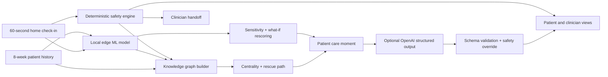

# Technical Architecture

Adherence OS is a browser-first prototype for at-home GLP-1 adherence support. It separates prediction, safety, explanation, and communication so each layer can be inspected during the demo.

## Intelligence Layers

### 1. Edge ML

- A monotonic logistic model is trained on 12,000 synthetic GLP-1 care sequences with projected-gradient sign constraints.
- The model is exported to `data/adherence-model.json`.
- Inference runs locally in the browser over 14 structured features.
- The UI exposes the intercept baseline, exact signed log-odds decomposition, one-feature-at-a-time sensitivity, calibration, and transparent what-if score changes.

### 2. Knowledge Graph

- Patient, symptom, routine, biomarker, risk, intervention, safety, and clinician nodes are assembled for the current check-in.
- Weighted centrality identifies the most connected active driver.
- A rescue path connects that driver to the strongest what-if action or to the safety handoff.
- Every node declares its provenance as model attribution, bounded simulation, deterministic rule, or patient context.
- Decision-path, selected-neighbourhood, attribution, and all-signal modes keep the live graph readable during inspection.
- All support routes are ranked by their rescored model assumptions; an active safety rule marks every simulated route as blocked.
- Graph-derived features can feed a future temporal or graph model.

### 3. Safety Engine

- No diagnosis.
- No medication start, stop, or dose-change advice.
- Red flags activate clinician or urgent-care escalation.
- The safety result is independent of the adherence prediction and can override it.

### 4. Optional LLM Layer

- The API asks OpenAI for schema-constrained care-plan output.
- Zod validates the response shape.
- Deterministic safety overrides are applied after generation.
- If the API is unavailable or invalid, the local engine returns a complete fallback plan.

## Demo Reliability

- All three patients and eight weeks of history are synthetic and checked into the repository.
- Normal and escalation scenarios are deterministic.
- The core demo works without a network connection or API key.
- The optional OpenAI layer improves communication but does not own safety or risk scoring.

## Prototype Limits

- The model metrics describe synthetic data and are not evidence of clinical performance.
- The graph is an explainable decision representation, not a validated causal model.
- Intervention simulations mutate explicit feature assumptions and rescore the model; they are not estimates of treatment effect.
- Local sensitivity varies one bounded feature at a time; it is not a confidence interval or clinical uncertainty estimate.
- Production deployment would require clinical validation, governance, monitoring, privacy review, and integration with eMed workflows.
