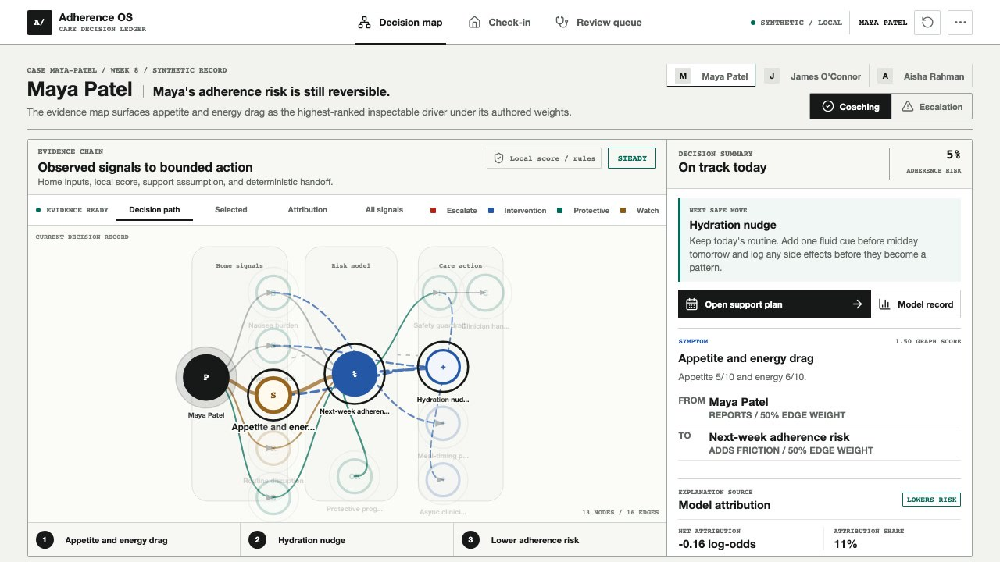
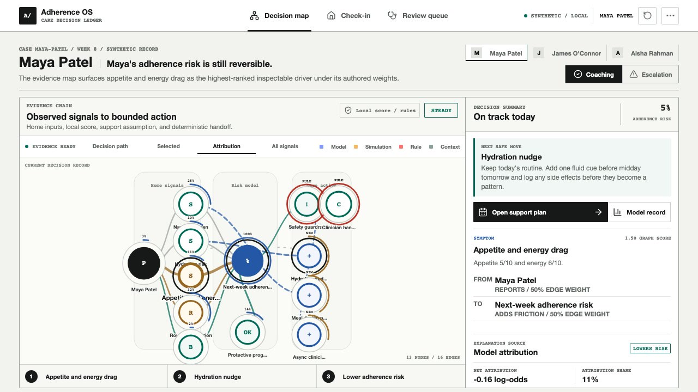
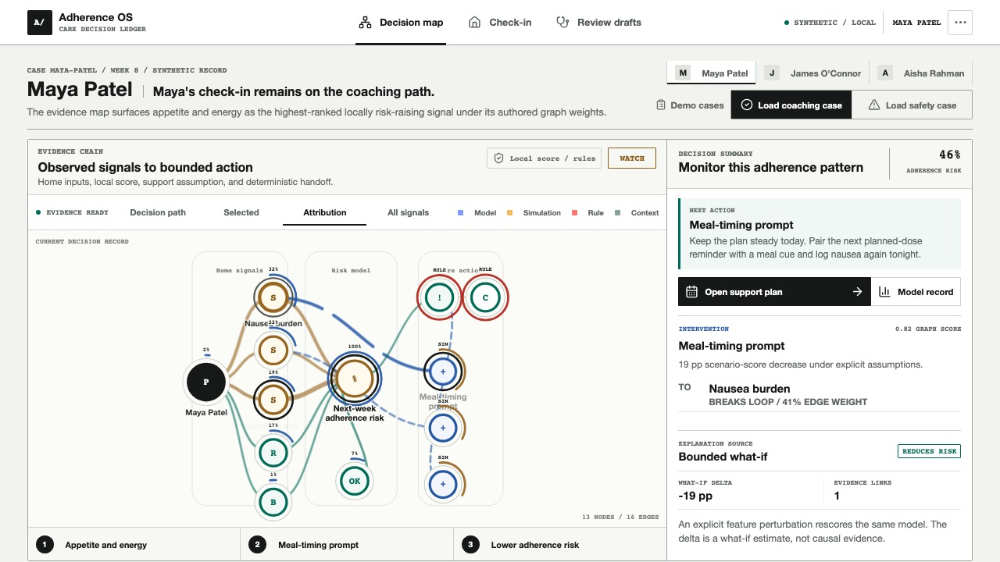
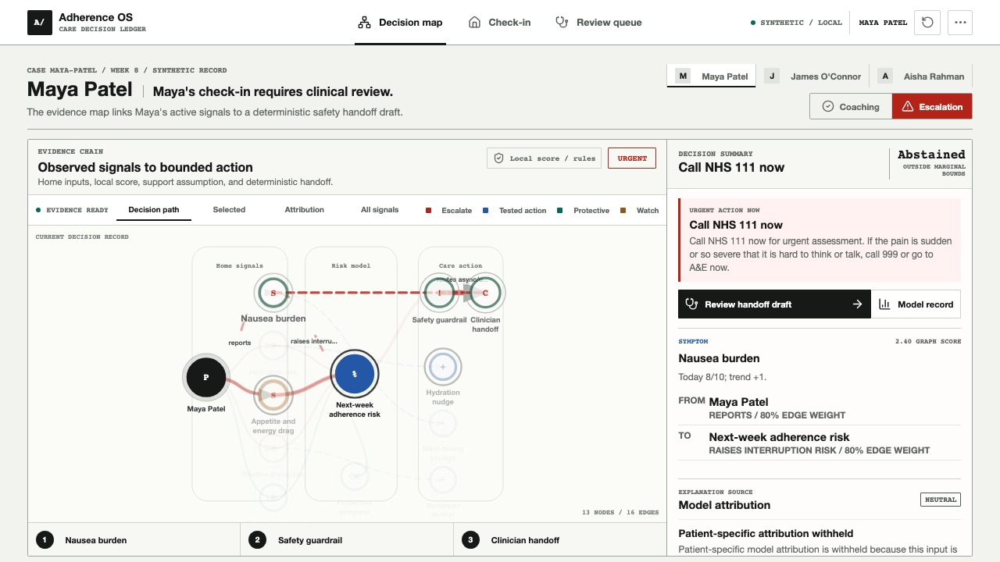
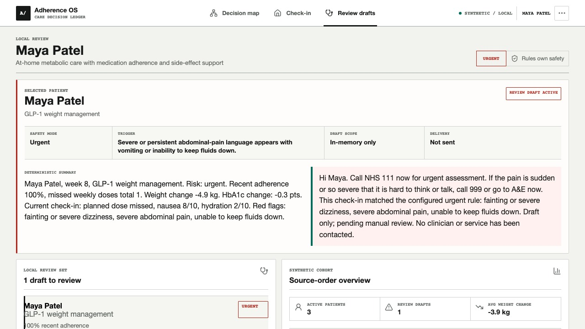
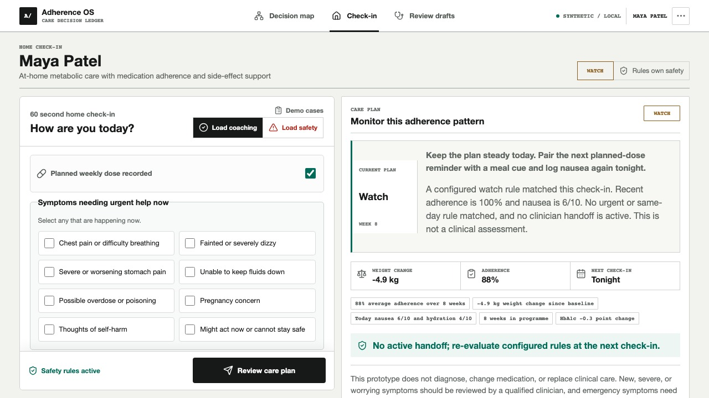
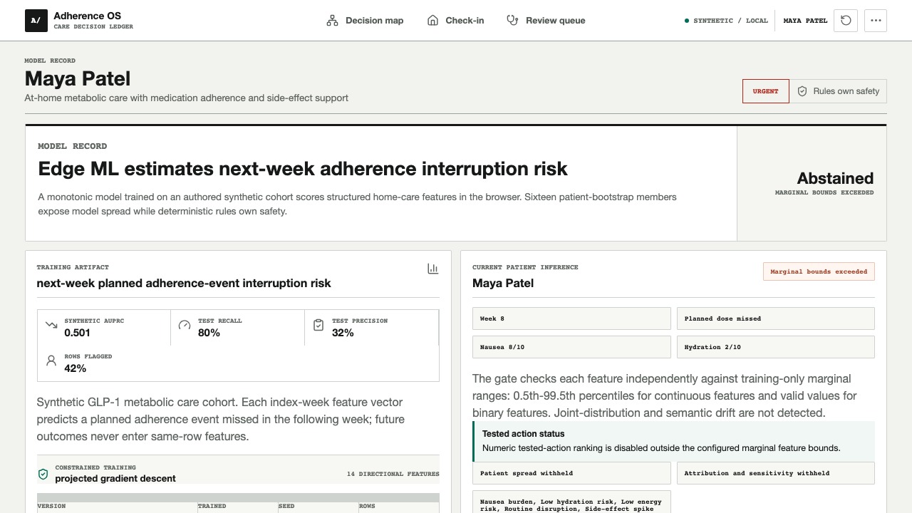
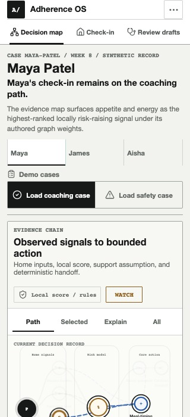
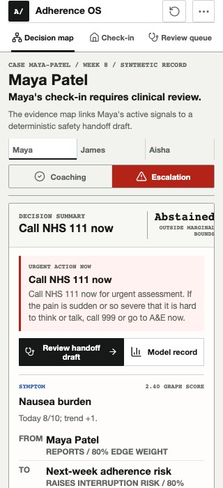

# Product Walkthrough

This walkthrough follows the exact production build used for release verification. Every patient and metric shown is synthetic. Use it to learn the product flow or as a visual fallback if a live demo is unavailable.

## 1. Start With The Evidence Chain



The opening view is a compact synthetic case record followed immediately by the evidence chain. It answers five questions: What is the next-week adherence-interruption risk? Which context signal ranks highest? Which model contributor explains the score? Which tested action changes it under bounded assumptions? Did a configured safety rule stop coaching?

The graph is the first substantial surface, while the adjacent decision record keeps the next bounded action and its provenance visible. **5%** is the local model output for this seeded synthetic check-in; it is not a medical-risk score.

## 2. Inspect The Model Contributor



Select **Attribution**, then **Routine disruption**. The graph reveals source labels and the inspector maps the node back to structured features. The signed log-odds contribution and attribution share come from the local logistic model.

Routine disruption is the largest model contributor for this supported input. Separately, appetite and energy drag is the highest-ranked context signal under authored graph weights. Neither label proves causality.

## 3. Inspect A Tested Action



Select **Hydration nudge**. The app changes explicit feature assumptions, rescores the same model, and reports a **2 percentage-point** scenario decrease. The tested action is only ranked while every observed and simulated feature remains inside its configured marginal bounds.

This is a planning comparison, not a treatment-effect estimate or medication recommendation.

## 4. Trigger The Safety Override



Select **Escalation**. The synthetic symptom vector moves outside model support, so numeric ML ranking **abstains**. Deterministic rules remain active, suppress tested actions, and switch the decision to the safety guardrail and an urgent clinician-review draft.

This is the key product boundary: model uncertainty cannot disable safety, and a high adherence-risk score is not required for red-flag escalation.

## 5. Review, Do Not Auto-Send



Select **Review handoff draft**. **Review queue** opens directly on the pending task with its trigger, unassigned owner, **Draft only / not sent** delivery state, longitudinal summary, patient-facing draft, and five-step audit trail.

The prototype prepares context for a human decision. It does not diagnose, make a medication change, assign a clinician, or claim that a message was delivered.

Each synthetic patient's local decision state is independent while the app remains open. Selecting another record does not clear Maya's review; **Reset demo** or a full refresh restores every seeded session.

## 6. See The Patient-Side Input



The **Check-in** view turns a short structured input into a care plan, adherence profile, seven-day support plan, rule trace, and eight-week context. A seven-item current-symptom checklist provides an explicit route into deterministic urgent mode; free-text phrase matching remains a secondary backstop. Editing any field recomputes the decision immediately and invalidates older in-flight provider requests.

The seeded **Normal** and **Escalation** controls exist for a repeatable judged demo; a field edit visibly changes the state to **Custom**.

## 7. Open The Model Record



The technical view exposes artifact versioning, the prospective target, patient-isolated splits, held-out synthetic AUPRC, recall, precision, rows flagged for review, threshold, Brier skill, calibration bins, and bounds-aware what-if behavior. Exact attribution, one-feature sensitivity, and bootstrap spread appear only when all marginal bounds pass.

The screenshot intentionally shows an abstention state. Patient score, attribution, bootstrap spread, sensitivity, and tested-action ranking are withheld; only artifact-level evidence, observed inputs, support exceptions, and deterministic safety remain visible.

## 8. Verify The Narrow Layout



At 320 px wide the app has zero horizontal page overflow. Navigation becomes a compact two-row product bar and patient/scenario controls stay tappable. Coaching remains graph-first and the complete context sentence remains visible without truncation.

## 9. Verify Urgent Mobile Ordering



Escalation moves the NHS 111 destination, immediate action, and **Review handoff draft** button ahead of graph exploration. Coaching actions and action relationships are suppressed from the default safety map; blocked alternatives remain available only in the explicit tested-action comparison.

## Reproduce The Walkthrough

```bash
pnpm install
pnpm build
pnpm start
```

Open `http://localhost:3000`, select **Reset demo**, and follow steps 1-9. In another terminal, run `pnpm smoke` to verify the home page, health route, patient routes, normal API path, and escalation API path.
