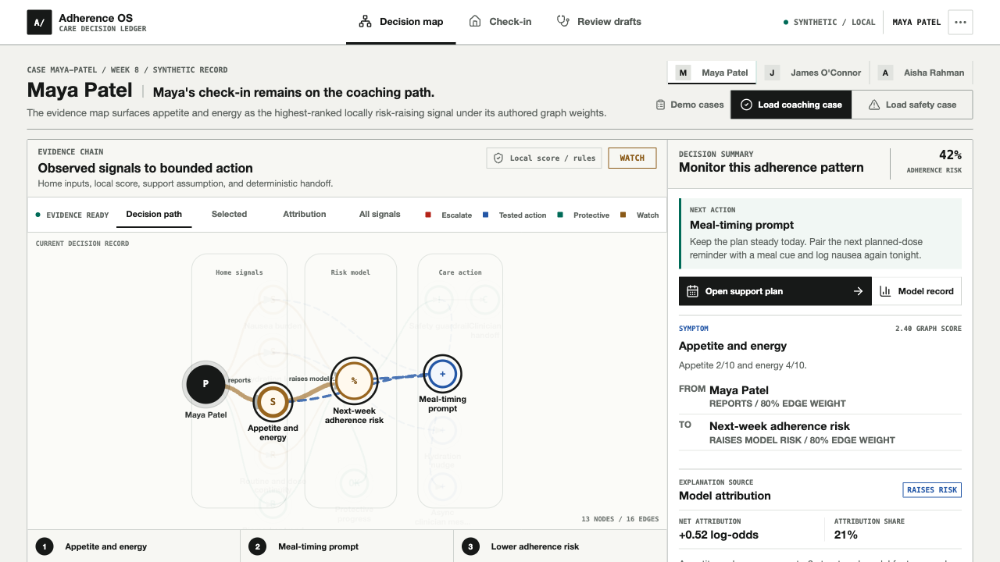
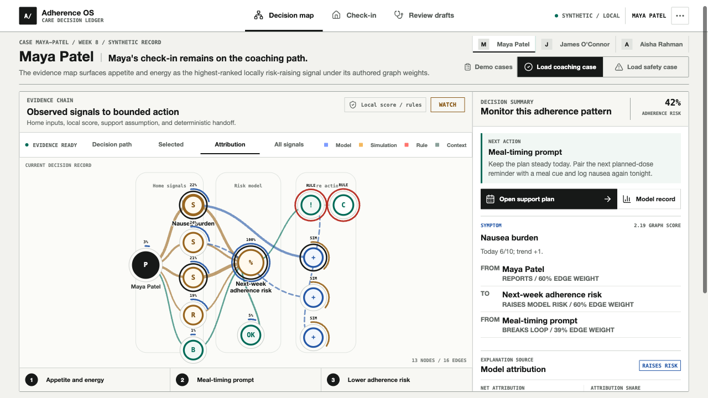
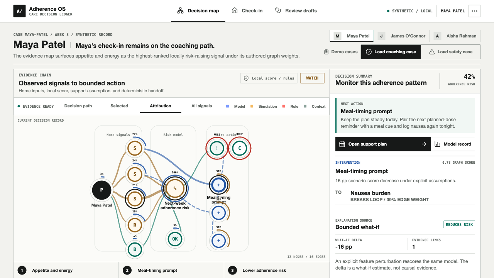
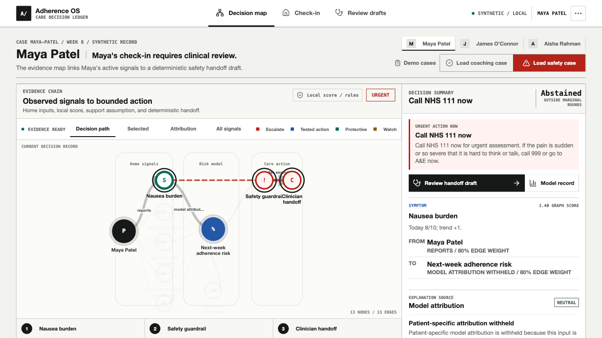
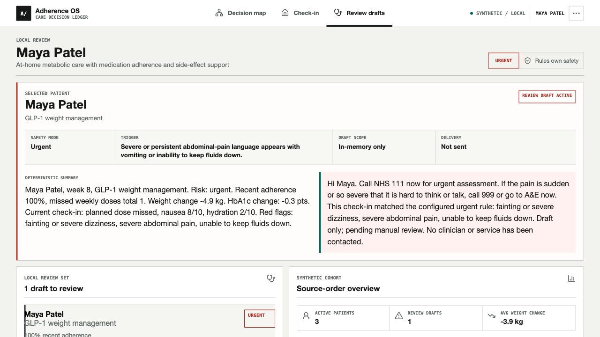
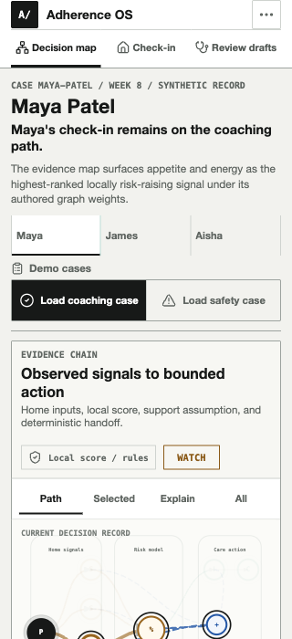

# Product Walkthrough

This walkthrough follows the exact production build used for release verification. Every patient and metric shown is synthetic. Use it to learn the product flow or as a visual fallback if a live demo is unavailable.

## 1. Start With The Evidence Chain



The opening view is a compact synthetic case record followed immediately by the evidence chain. It answers five questions: What is the next-week adherence-interruption risk? Which context signal ranks highest? Which model contributor explains the score? Which tested action changes it under bounded assumptions? Did a configured safety rule stop coaching?

The graph is the first substantial surface, while the adjacent decision record keeps the next bounded action and its provenance visible. **42%** is the local model output for this seeded synthetic check-in; it is an adherence-interruption score from synthetic data, not a medical-risk score.

## 2. Inspect The Model Contributor



Select **Attribution**, then **Nausea burden**. The graph reveals source labels and the inspector maps the node back to nausea and side-effect-spike features. The signed log-odds contribution and attribution share come from the local logistic model.

Nausea burden is the largest risk-raising model group for this supported input. Separately, appetite and energy is the highest-ranked risk-raising signal under authored graph weights. Every edge label is derived from the signed local contribution, so a protective group cannot be described as adding risk. None of these labels proves causality.

## 3. Inspect A Tested Action



Select **Meal-timing prompt**. The app changes explicit feature assumptions, rescores the same model, and reports a **16 percentage-point** scenario decrease. The tested action is only ranked while every observed and simulated feature remains inside its configured marginal bounds.

This is a planning comparison, not a treatment-effect estimate or medication recommendation.

## 4. Trigger The Safety Override



Select **Load safety case**. The synthetic symptom vector exceeds configured marginal feature bounds, so numeric ML ranking **abstains**. Deterministic rules remain active, suppress tested actions, and switch the decision to the safety guardrail and an urgent clinician-review draft.

This is the key product boundary: model uncertainty cannot disable safety, and a high adherence-risk score is not required for red-flag escalation.

## 5. Review, Do Not Auto-Send



Select **Review handoff draft**. **Review drafts** opens directly on the local record with its trigger, **In-memory only** scope, **Not sent** delivery state, longitudinal summary, patient-facing draft, and five-step audit trail.

The prototype prepares context for a human decision. It does not diagnose, make a medication change, assign a clinician, or claim that a message was delivered.

Each synthetic patient's local decision state is independent while the app remains open. Selecting another record does not clear Maya's review; **Reset demo session** in Resources or a full refresh restores every seeded session. When no same-day or urgent draft exists, the queue and message area now render a literal empty state instead of coaching records.

## 6. See The Patient-Side Input


The **Check-in** view turns a short structured input into a care plan, adherence profile, seven-day support plan, rule trace, and eight-week context. An eight-item current-symptom checklist provides an explicit route into deterministic urgent mode; free-text phrase matching remains a secondary backstop. Editing any field recomputes the decision immediately and invalidates older in-flight provider requests.

The seeded **Load coaching** and **Load safety** controls are explicitly labelled **Demo cases**; they load repeatable presenter fixtures rather than letting a patient choose a clinical state. A field edit visibly changes the state to **Custom**. The review action remains visible at desktop and mobile sizes while optional context notes stay editable in an expander.

## 7. Open The Model Record


The technical view opens with an exported held-out challenger benchmark. At the same validation-only recall target, the 14-feature model flags 33% of all held-out synthetic rows at 29% precision, compared with 57% at 16% precision for a recent-adherence-only logistic baseline. The same record reports that the runtime gate scores 90% of rows, abstains on 180, and achieves 26% precision and 74% recall on the scored subset. These are pipeline comparisons, not measured staffing savings or clinical validation.

Below that proof, the view exposes artifact and raw-feature-contract versioning, the prospective target, patient-isolated splits, threshold, Brier skill, calibration bins, and bounds-aware what-if behavior. Exact attribution, one-feature sensitivity, and bootstrap spread appear only when all marginal bounds pass.

The screenshot intentionally shows an abstention state. Patient score, attribution, bootstrap spread, sensitivity, and tested-action ranking are withheld; only artifact-level evidence, observed inputs, support exceptions, and deterministic safety remain visible.

## 8. Verify The Narrow Layout



At 320 px wide the app has zero horizontal page overflow. Navigation becomes a compact two-row product bar, presenter controls retain 44 px targets, and Review care plan remains fixed in view. The coaching case remains graph-first and the complete context sentence remains visible without truncation.

## 9. Verify Urgent Mobile Ordering


Load safety case moves the NHS 111 destination, immediate action, and **Review handoff draft** button ahead of graph exploration. Coaching actions and action relationships are suppressed from the default safety map; blocked alternatives remain available only in the explicit tested-action comparison.

## Reproduce The Walkthrough

```bash
pnpm install
pnpm build
pnpm start
```

Open `http://localhost:3000`, choose **Reset demo session** from Resources, and follow steps 1-9. In another terminal, run `pnpm smoke` to verify the home page, health route, patient routes, coaching API path, and safety API path.
