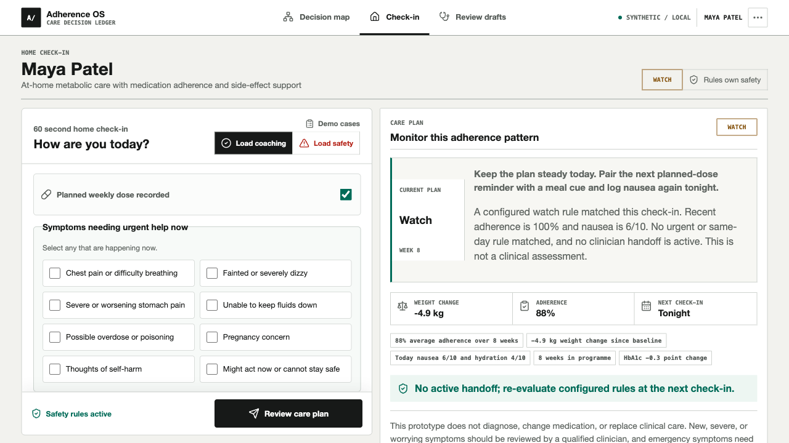
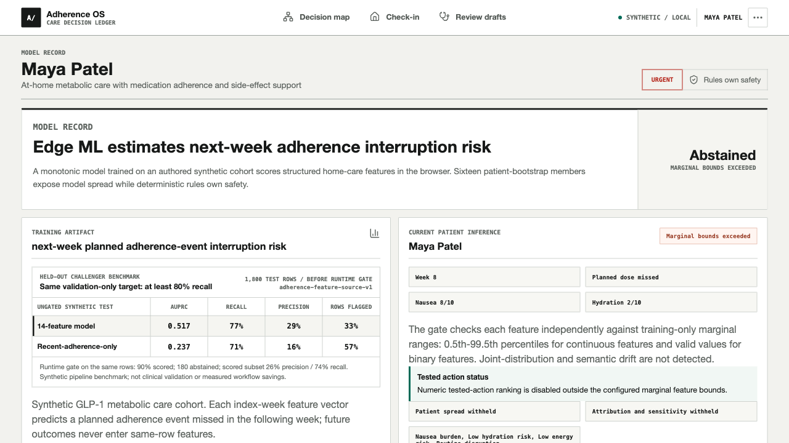
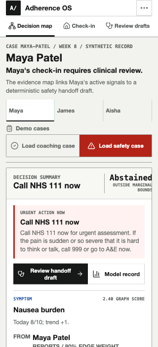

# Adherence OS Screenshot Evidence

Every image in this directory is produced by `scripts/capture-walkthrough.mjs` from a running production build. The same files are mirrored to `public/walkthrough/` for GitHub and browser rendering.

## 01 Live Twin Coaching


Shows the first judged viewport: one synthetic patient, supported next-week adherence risk, evidence graph, bounded action, and safety state. Notice that graph provenance and the operational decision share one screen without presenting the model as medical triage.

## 02 Attribution Driver


Shows a selected model contributor with evidence and provenance. It solves the reviewer question “why did this score move?” through exact signed model decomposition rather than generated explanation text.

## 03 Bounded Support Route


Shows an explicit feature-assumption comparison and its rescored scenario. Notice the non-causal language, support gate, and stable graph interaction.

## 04 Safety Escalation


Shows the central safety contract: patient-specific ML evidence is withheld, coaching routes disappear, and deterministic NHS 111 routing remains active. The user problem is urgent support without waiting for another model or appointment.

## 05 Clinician Handoff Review


Shows a structured in-memory draft, trigger, longitudinal summary, delivery state, and audit trace. Notice that the interface says “Not sent” and never invents assignment or delivery infrastructure.

## 06 Patient Check-In



Shows the patient-facing structured task, current-symptom flags, and persistent review action. It demonstrates role-specific UX rather than reusing the dense technical graph interface.

## 07 Model Evidence



Shows the all-row challenger comparison, separate runtime-gated population, artifact provenance, and `adherence-feature-source-v1`. Notice the synthetic-validation caveat and the absence of a fabricated production claim.

## 08 Mobile Coaching


Shows graph-first coaching at 320 px without page overflow. Presenter controls retain usable targets and the decision remains readable.

## 09 Mobile Safety



Shows the narrow safety reading order: destination and human handoff precede graph exploration. This is the mobile safety requirement, not decorative responsiveness.

## Reproduce

```bash
pnpm build
pnpm start
APP_URL=http://127.0.0.1:3000 pnpm capture:walkthrough
```
